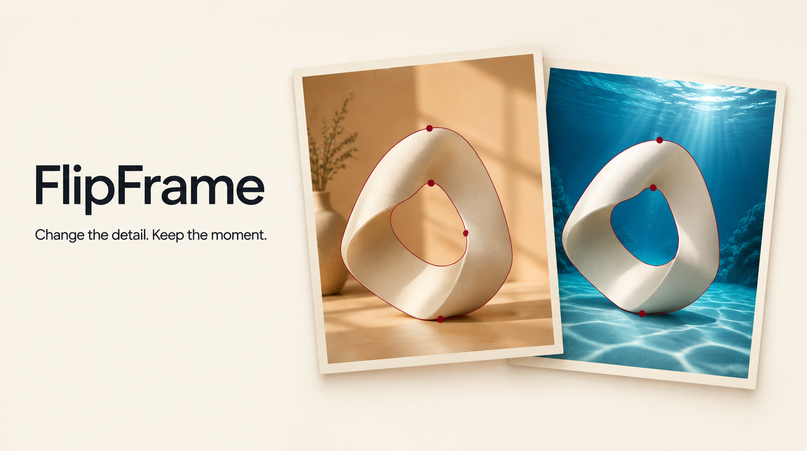
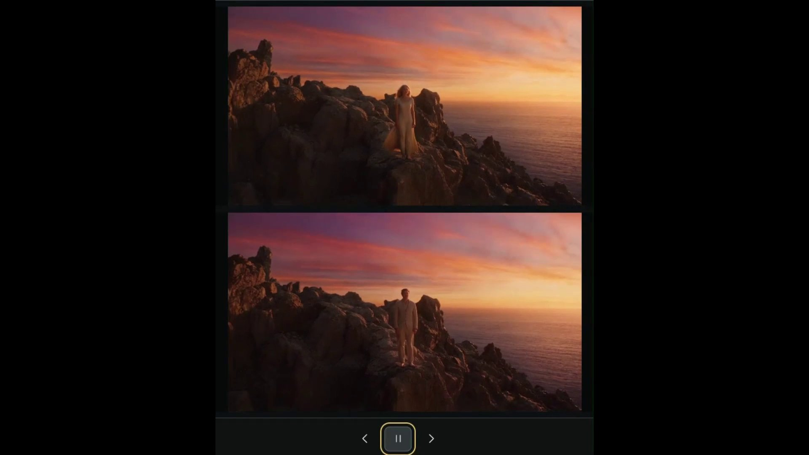
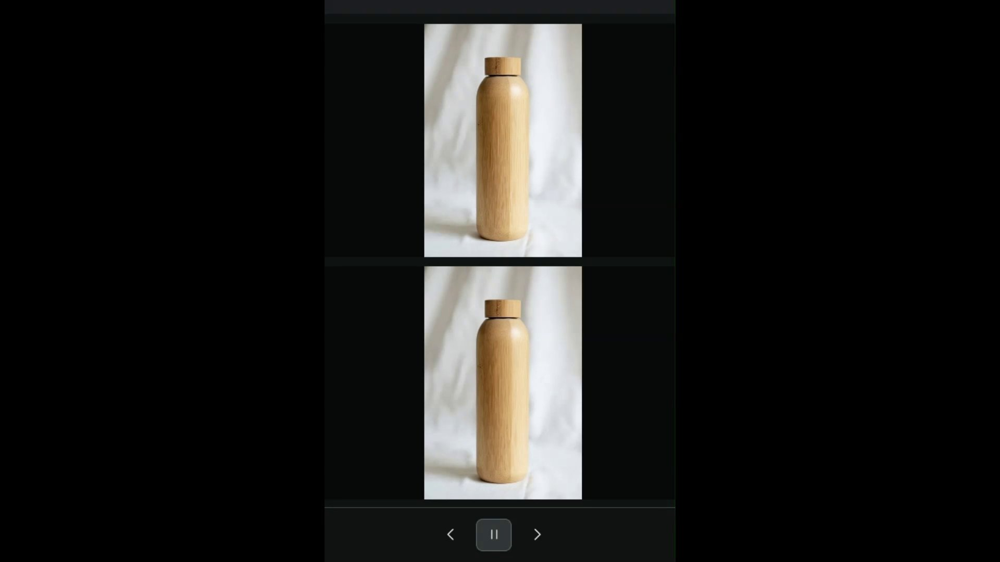

# FlipFrame

### Change the detail. Keep the moment.



*Concept artwork above. Watch actual FlipFrame comparisons below.*

FlipFrame is an open-source video editor for the part you want to change—and the rest you want to keep. Bring your own footage or generate a video, tell the assistant what you have in mind, and choose exactly where and when the edit belongs.

Recolor a product. Replace a background. Keep the shot you already like.

Conversation gets you started; hands-on controls help you get precise. Pause on a frame, select an object, adjust its outline, and track it through your chosen time range. Review the result beside the original before applying it. Your original stays available.

## See the difference

### 01 · Change an object

A woman in a flowing dress becomes a man in a light suit, with the rocky coastline and sunset retained around the subject. Original on top; edited result below.

[](docs/assets/mountain-comparison.mp4)

[Watch the object-edit comparison · 2 seconds](docs/assets/mountain-comparison.mp4)

### 02 · Change the background

A wooden bottle in a light product setup, shown in a stacked comparison. Watch the backdrop and shadow detail around the bottle as you compare the original above with the edited result below.

[](docs/assets/bottle-comparison.mp4)

[Watch the bottle comparison · 4 seconds](docs/assets/bottle-comparison.mp4)

## From an idea to an edit

1. **Bring in a video.** Import footage or generate a starting clip.
2. **Choose the moment.** Set the start and end time, then select what you want to change—or protect.
3. **Make your request.** Describe the edit and review its scope and estimated cost.
4. **Check the result.** Compare the candidate with your original, then apply it when you're happy.

Background replacement uses a local compositor to preserve reviewed foreground pixels. Selection matters: tracking and generated video can make mistakes, and openings must be excluded from the object mask. Review the boundary across the whole edit. FlipFrame does not promise perfect results from every model or mask.

## Run it on Windows

Extract the **entire Windows ZIP**, then open **FlipFrame.exe**. Keep it beside the bundled app and runtime folders. The launcher starts a local server and opens Studio in your browser; it is not an installer or an embedded browser.

Basic Node and Python runtimes are included. Remote AI features need internet access and your own provider credentials. Large optional segmentation models are separate downloads; see [SETUP.txt](SETUP.txt).

Studio prompts for missing assistant and video connections. You can skip setup and use local features; missing connections are offered again when you reopen Studio. Saved credentials are never returned to the setup screen. Configuration checks do not verify account validity or available credit.

Paid generation requires a **positive local spending allowance**. The default is zero; entering a key does not make generation free. See [pricing and budget accounting](app/PRICING.md).

Projects, connections and model caches live in `%LOCALAPPDATA%\FlipFrame`. Keep that folder when updating. Development checkouts keep app-local data unless `FLIPFRAME_USER_DIR` is set.

**Preview release:** the Windows build is unsigned and may show an unknown-publisher warning. Public distribution still needs clean-machine verification, versioned checksums and the codec source/licensing work described in [third-party notices](THIRD_PARTY_NOTICES.md).

## Connections and local tools

- **Video generation:** Higgsfield.
- **Assistant:** configured Jev/TypeSafe, OpenAI-compatible, Anthropic and Gemini adapters.
- **Selection:** SAM 2 tracking and automatic background selection need optional model runtimes. CPU processing is available, but can be slow.
- **Comparison:** enlarged previews use a lightweight viewing copy, with a full-quality option. Applying an edit uses the master.
- **Automation:** the documented [local agent API](app/AGENT_API.md) lets an agent work with the app.

Local mode stays on loopback. This portable preview is not a reviewed multi-user internet deployment.

## Develop from source

Use Node.js **22.13+** with `node:sqlite` and Python **3.10+**. The pinned Windows CUDA setup requires Python 3.10.

```text
cd app
npm ci
python -m pip install -r requirements.txt
npm run build
npm start
```

Open the localhost address printed by the server. Add credentials in Studio, or privately copy `.env.example` to `.env.local`. Never commit populated environment files.

[Contributing](CONTRIBUTING.md) · [Security](SECURITY.md) · [Setup guide](SETUP.txt)

## License

FlipFrame code is [MIT licensed](LICENSE). Third-party runtimes, packages, codecs, model code and weights keep their own licenses. MIT does not grant rights to provider services, uploaded media, trademarks or third-party assets. Review third-party notices before redistributing binaries.
